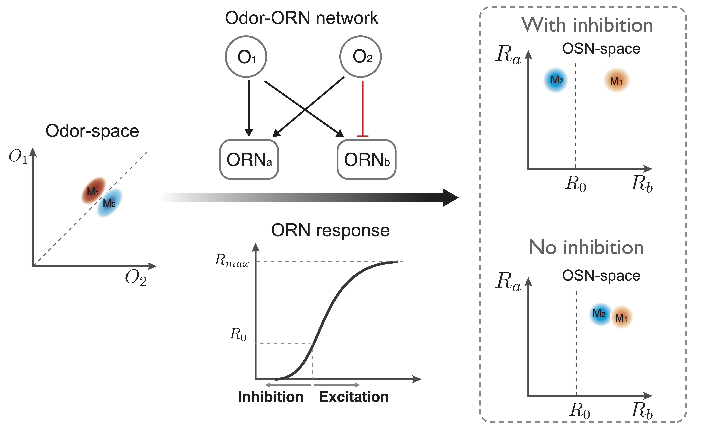

## Nonlinear compressed sensing at olfactory periphery
The periphery sensory systems are the gateway between the physical world and the brain. Olfaction plays a vital role in the survival of many animals. A fundamental question in olfaction is how to represent and process the environmental odors, which are typically mixtures of a few odorants from a huge number of possible odorants, each with a broad distribution of concentrations. While the possible odorants and their mixture in the natural environment is much larger than the number of olfactory receptor neurons (ORNs), which respond to odorant concentration non- linearly (sigmoidal) with a finite sensitivity range. Thus, how to encode numerous sparse odor mixtures with a relatively small number of nonlinear ORNs – the nonlinear compressed sensing problem – remains a puzzle.

Using an information theory approach, I studied the optimal coding strategies that enable nonlinear ORNs to best represent olfactory information (both the odorants’ identities and their concentrations) in sparse odor mixtures. I showed that the optimal odor-receptor sensitivity matrix is sparse, and the nonzero sensitivities follow a broad distribution (matching the statistics of the odorants), both of which are consistent with existing experiments. For ORNs with a finite basal activity, my study shows that co-existence of both odor-evoked excitation and inhibition increases coding capacity, which provides a plausible explanation for such co-existence observed in the fly olfactory system. Furthermore, I showed that coding the inputs with the optimal sensitivity matrix can enhance the accuracy of the downstream decoding and learning tasks. These general statistical properties of the optimal sensitivity matrix for nonlinear compressed sensing may shed light on understanding the peripheral olfactory sensory system.

> **S. Qin**, Q. Li, C. Tang and Y. Tu, “Optimal compressed sensing strategies for an array of nonlinear olfactory receptor neurons with and without spontaneous activity”, *Proc. Natl. Acad. Sci. U.S.A.*, **116**, 20286 (2019).

## Functional role of spontaneous activity and odor-evoked inhibition in ORNs

Inhibitory response occurs throughout the nervous system, including the peripheral olfactory system. While odor-evoked excitation in peripheral olfactory cells is known to encode odor information, the molecular mechanism and functional roles of odor-evoked inhibition remain largely unknown. Here, we examined Drosophila olfactory sensory neurons and found that inhibitory odors triggered outward receptor currents by reducing the constitutive activities of odorant receptors, inhibiting the basal spike firing in olfactory sensory neurons. Remarkably, this odor-evoked inhibition of olfactory sensory neurons elicited by itself a full range of olfactory behaviors from attraction to avoidance, as did odor-evoked olfactory sensory neuron excitation. These results indicated that peripheral inhibition is comparable to excitation in encoding sensory signals rather than merely regulating excitation. Furthermore, we demonstrated that a bidirectional code with both odor-evoked inhibition and excitation in single olfactory sensory neurons increases the odor-coding capacity, providing a means of efficient sensory encoding.

> L. Cao, D. Yang, W. Wu, X. Zeng, B. Jing, M. Li, **S. Qin**, C. Tang, Y. Tu, D. Luo, Odor- evoked inhibition of olfactory sensory neurons drives olfactory perception in Drosophila, Nature Communications, 8, 1357 (2017).
